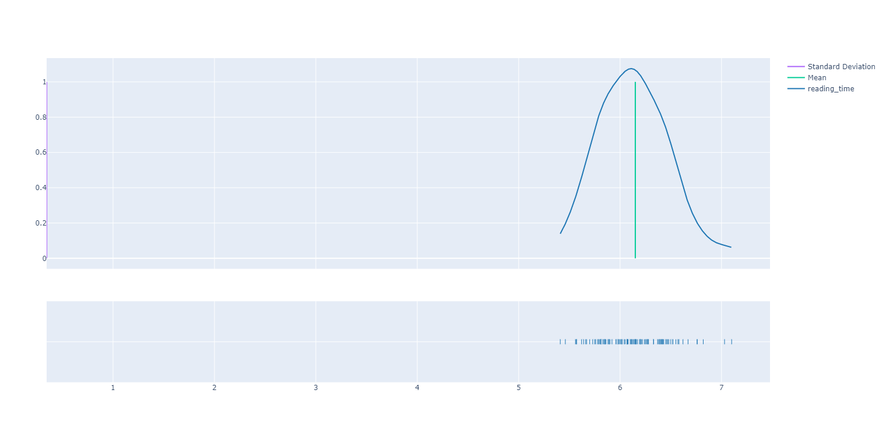
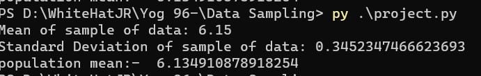

# PRO-C110: DATA SAMPLING

In Class 110, we learnt about the finding of the properties of the normal distribution..

Goal

- We will write the program to find the inference on the data points of standard deviation 1,2
and 3.

Result:

